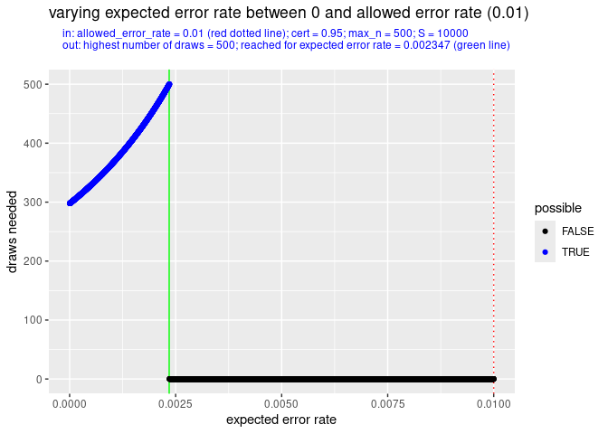
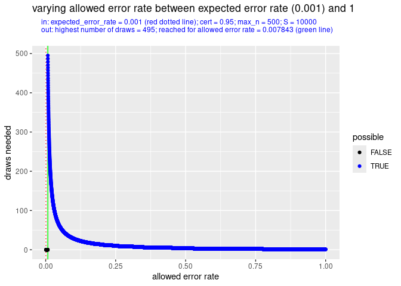
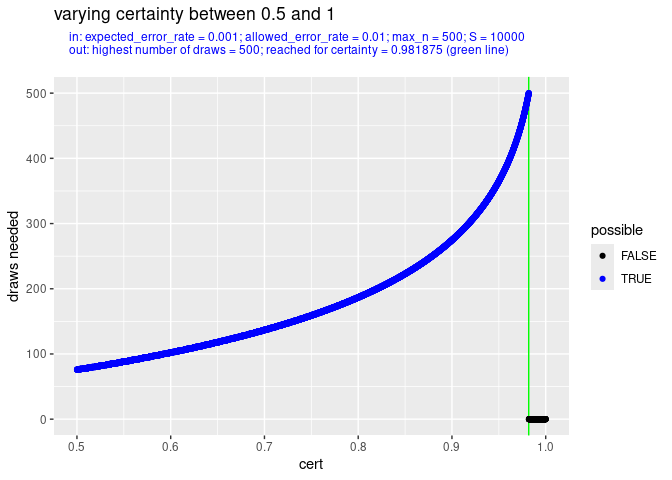
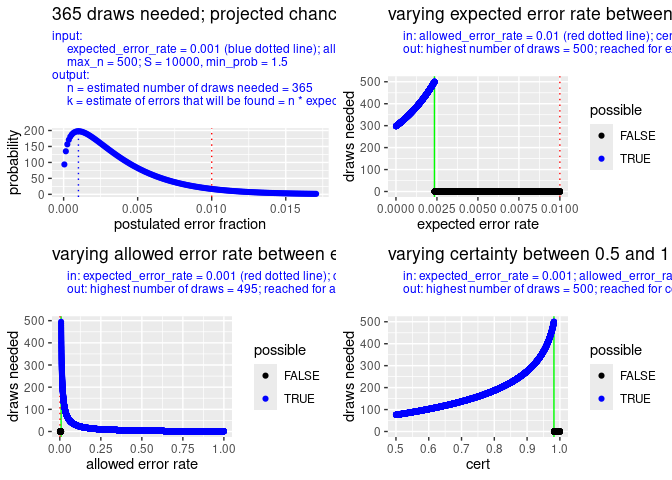
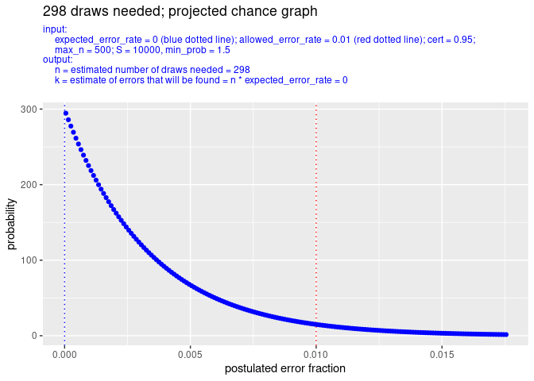
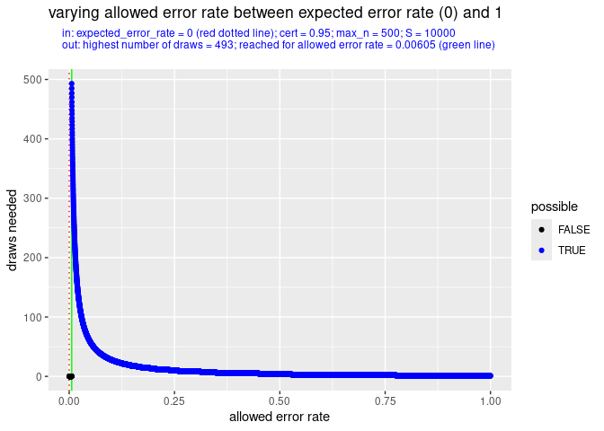
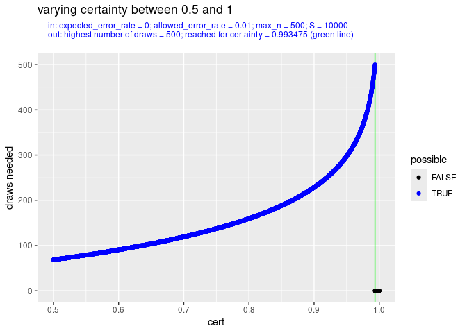
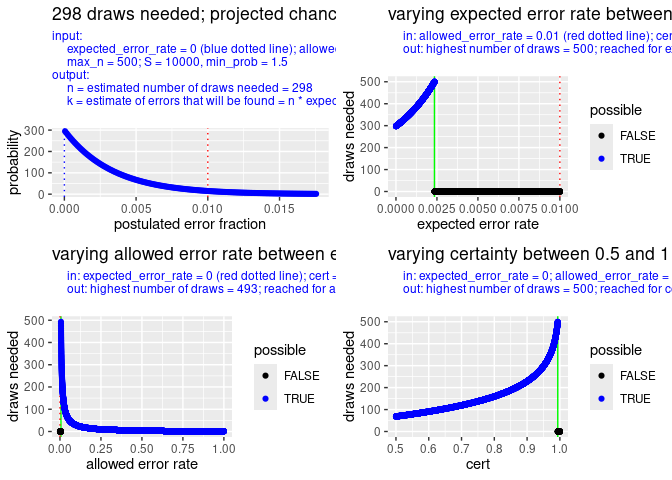

<!--README.md is generated from README.Rmd. Please edit that file -->

<!-- badges: start -->

[](https://github.com/cfjdoedens/drawsneeded/actions/workflows/R-CMD-check.yaml)

[](https://app.codecov.io/gh/cfjdoedens/drawsneeded)

<!-- badges: end -->

# drawsneeded

## Introduction

Supports monetary unit sampling. In monetary unit sampling we have a
file of monetary statements. In general this concerns money that has
been spent. We want to estimate the percentage of money from the file
that was wrongfully spent, the error rate.

This package has the function

- drawsneeded(expected_error_rate, allowed_error_rate, cert, max_n)

The function gives an estimate of the number of monetary unit draws
needed to establish with some certainty, *cert*, that the error rate is
below a certain threshold, *allowed_error_rate*. The assumption of
drawsneeded() is that each drawn statement contains 100 x
*expected_error_rate* percent error. Most often, in real life, most
monetary statements will contain no errors at all, and some statements
will have large errors, or are even totally wrong. Still, we suppose
that this assumption leaves the estimates of drawsneeded() realistic.

Due to randomness, the actual number of monetary unit draws needed might
be smaller or bigger. Also, it might turn out, that the file has a
higher error rate than allowed_error_rate. In that case no amount of
draws will suffice to prove that the error rate is below
allowed_error_rate.

The package has a couple of plotting functions:

- drawsneeded_plot()
- margin_plot_varying_expected_error_rate()
- margin_plot_varying_allowed_error_rate()
- margin_plot_varying_cert()
- combined_plot()

These should give the user insight in the relation between number of
draws taken and resulting estimates about the error rate in the file
that is audited.

## Interpretation of the value returned by drawsneeded()

As said, the function drawsneeded(expected_error_rate,
allowed_error_rate, cert, max_n) gives an estimate of the number of
monetary unit draw items needed to establish with some certainty, cert,
e.g. 0.95, that the error rate is below allowed_error_rate. For this
estimation it assumes that the actual error rate in the file of monetary
statements equals the expected_error_rate.

Of course, this assumption is nearly always wrong as it is highly
unlikely that the expected error rate equals exactly the actual error
rate. However, when the expected_error_rate is chosen conservative, i.e.
on the high side, it can be used with some confidence to produce a not
too low number.

The function then assumes that each drawn item has an error rate of
expected_error_rate. And it computes the minimum number of drawn items
necessary to establish with cert certainty that expected_error_rate \<
allowed_error_rate.

The computation of this minimum is based on the binomial distribution.
This is extended with the beta distribution to allow for non integer
values of errors. (The binomial distribution assumes that there are very
many items to draw from, which all have equal chance of being drawn, and
there are so many items that when we have drawn some this does not
change in a substantial way the rate of erroneous items.)

The idea is that we can in this way estimate the number of to be drawn
items, to statistically prove that the actual error rate is smaller than
the allowed error rate. And this without using in the proof any
knowledge about the expected error rate. To summarize, the function uses
the expected error rate to compute an estimate of the necessary number
of to be drawn items, where only these checked items are used to prove
the value of the error rate of the file of monetary items. So
expected_error_rate is only used for the planning part!

## Usage

### General

Using drawsneeded() is a simple and cheap way to estimate the effort,
needed to statistically establish the error rate in a file of financial
statements.

### No need to stick to the planning for actual drawing and checking

The number that is produced by drawsneeded() gives an estimate of how
many draws are needed to establish the error rate in a file of financial
statements. In order to have a statistical sound estimate of the error
rate of a file of financial statements it is not necessary to stick to
that planned number for actual drawing and evaluation! The number is
just an indication of the effort needed.

For example, when drawsneeded() estimates that there are 365 draws
needed (see one of the examples below), it might turn out that after 298
draws checked, not one error was found. If the 298 items were chosen
randomly, based on monetary value, over the total file of monetary
statements it can be safely concluded that the error rate is not more
than 1 %. And there is no need to check the other 67 items.

On the other hand, when it turns out that the error rate of the drawn
and evaluated so far items is above the expected_error_rate, one can do
a new call on drawsneeded() to establish a new, and forcibly higher,
number of draws that are needed. The extra items to be drawn should be
chosen randomly chosen, based on monetary value, over the total file of
monetary statements.

### Combination with incremental drawing

In order to minimize the number of to be drawn and to be checked
monetary statements one can explicitly proceed by making an optimistic,
i.e. low, guess of the expected_error_rate, and once this indeed turns
out to be too optimistic, plan anew as described above with the actual
error rate found in the already checked monetary statements.

## Installation

You can install the development version of drawsneeded from
[GitHub](https://github.com/) with:

``` r
if (file.exists("/home/crist-jan/R/x86_64-pc-linux-gnu-library/4.5/drawsneeded")) {
  # We are executing on the author machine, use the development version available there.
  library("drawsneeded")
  print("using files directly from author of package; not from github")
} else {
  # Use the github version.
  if (!requireNamespace("pak", quietly = TRUE)) {
    install.packages("pak")
  }
  pak::pak("cfjdoedens/drawsneeded")
  print("using files from github")
}
#> [1] "using files directly from author of package; not from github"
```

## Example: 0.1 percent error expected

### expected_error_rate = *0.001*, allowed_error_rate = 0.01, cert = 0.95, max_n = 500

Suppose you know from previous experience that a small error rate might
exist in the mass of monetary statements. You estimate the error rate to
be no more than 0.1 percent of the total mass in money. So you set
expected_error_rate to 0.001. You need a result with 95% certainty. So
you set certainty to 0.95, You decide that the maximum number of samples
you are willing to draw and check is 500. So you set max_n to 500.

``` r
drawsneeded(expected_error_rate = 0.001, allowed_error_rate = 0.01, cert = 0.95, max_n = 500)
#> [1] 365
```

The conclusion is that you will need at least 365 samples.

In a picture this looks like:

``` r
drawsneeded_plot(expected_error_rate = 0.001,  allowed_error_rate = 0.01, cert = 0.95, max_n = 500)
```


We can further analyse the situation by varying over
expected_error_rate, or over allowed_error_rate or over cert. See the
following three plots.

### Varying over the expected error rate

First we vary over the expected error rate:

``` r
margin_plot_varying_expected_error_rate(allowed_error_rate = 0.01, cert = 0.95, max_n = 500)
```



We see that as expected_error_rate goes near to allowed_error_rate, the
number of draws needed rises.

We can also study this in a non graphical way:

``` r
drawsneeded(expected_error_rate = seq(from = 0.0, by = 0.001, to = 0.009), allowed_error_rate = 0.01, cert = 0.95, max_n = 500)
#>     0 0.001 0.002 0.003 0.004 0.005 0.006 0.007 0.008 0.009 
#>   298   365   458    -1    -1    -1    -1    -1    -1    -1
```

Again we see that for an expected error rate of 0.001, we need 365
draws.

### Varying over the allowed error rate

``` r
margin_plot_varying_allowed_error_rate(expected_error_rate = 0.001, cert = 0.95, max_n = 500)
```



We see that as the allowed_error_rate moves away from the
expected_error_rate, the number of draws falls sharply.

Non graphically this looks like (note the 365 computed draws needed for
allowed error rate 0.01):

``` r
drawsneeded(expected_error_rate = 0.001, allowed_error_rate = seq(from = 0.002, by = 0.001, to = 0.01), cert = 0.95, max_n = 500)
#> 0.002 0.003 0.004 0.005 0.006 0.007 0.008 0.009  0.01 
#>    -1    -1    -1    -1    -1    -1   482   415   365
```

and,

``` r
drawsneeded(expected_error_rate = 0.001, allowed_error_rate = seq(from = 0.02, by = 0.01, to = 0.1), cert = 0.95, max_n = 500)
#> 0.02 0.03 0.04 0.05 0.06 0.07 0.08 0.09  0.1 
#>  163  104   76   60   49   42   36   32   28
```

and,

``` r
drawsneeded(expected_error_rate = 0.001, allowed_error_rate = seq(from = 0.2, by = 0.1, to = 0.9), cert = 0.95, max_n = 500)
#> 0.2 0.3 0.4 0.5 0.6 0.7 0.8 0.9 
#>  13   8   5   4   3   2   1   1
```

### Varying over the certainty

Finally we can also vary over the certainty we apply.

``` r
margin_plot_varying_cert(expected_error_rate = 0.001, allowed_error_rate = 0.01, max_n = 500)
```



As might be expected: if we can do with less certainty, then we need
less draws.

In raw numbers this looks like:

``` r
drawsneeded(expected_error_rate = 0.001, allowed_error_rate = 0.01, cert = seq(from = 0.50, by = 0.05, to = 0.95), max_n = 500)
#>  0.5 0.55  0.6 0.65  0.7 0.75  0.8 0.85  0.9 0.95 
#>   76   88  102  118  137  159  187  223  275  365
```

Note that for cert 0.95, we get again 365 draws needed.

### All plots bundled in one picture

We can call combined_plots() to get all four plots in one picture.
However, it is does not look very slick here due to lack of canvas
space.

``` r
combined_plots(expected_error_rate = 0.001, allowed_error_rate = 0.01, cert = 0.95, max_n = 500)
```



## Example: no error expected

### expected_error_rate = 0, allowed_error_rate = 0.01, cert = 0.95, max_n = 500

You might expect to see no error at all in the to be audited file of
monetary statements. Then you could calculate as follows:

``` r
drawsneeded(expected_error_rate = 0, allowed_error_rate = 0.01, cert = 0.95, max_n = 500)
#> [1] 298
```

So then 298 samples is sufficient.

In a picture this looks like:

``` r
drawsneeded_plot(expected_error_rate = 0, allowed_error_rate = 0.01, cert = 0.95, max_n = 500)
```



Again, we can further analyse the situation by varying over
expected_error_rate, or over allowed_error_rate or over cert. As we have
above already studied varying the expected_error_rate, we will not
repeat that here.

### Varying over the allowed error rate

``` r
margin_plot_varying_allowed_error_rate(expected_error_rate = 0, cert = 0.95, max_n = 500)
```



We see that as the allowed_error_rate moves away from the
expected_error_rate, the number of draws falls sharply.

Non graphically this looks like:

``` r
drawsneeded(expected_error_rate = 0, allowed_error_rate = seq(from = 0.001, by = 0.001, to = 0.01), cert = 0.95, max_n = 500)
#> 0.001 0.002 0.003 0.004 0.005 0.006 0.007 0.008 0.009  0.01 
#>    -1    -1    -1    -1    -1   497   426   372   331   298
```

and,

``` r
drawsneeded(expected_error_rate = 0, allowed_error_rate = seq(from = 0.02, by = 0.01, to = 0.1), cert = 0.95, max_n = 500)
#> 0.02 0.03 0.04 0.05 0.06 0.07 0.08 0.09  0.1 
#>  148   98   73   58   48   41   35   31   28
```

and,

``` r
drawsneeded(expected_error_rate = 0, allowed_error_rate = seq(from = 0.2, by = 0.1, to = 0.9), cert = 0.95, max_n = 500)
#> 0.2 0.3 0.4 0.5 0.6 0.7 0.8 0.9 
#>  13   8   5   4   3   2   1   1
```

### Varying over the certainty

Finally we can also vary over the certainty we apply.

``` r
margin_plot_varying_cert(expected_error_rate = 0, allowed_error_rate = 0.01, max_n = 500)
```



As might be expected: more certainty needs more draws.

In raw numbers this looks like:

``` r
drawsneeded(expected_error_rate = 0, allowed_error_rate = 0.01, cert = seq(from = 0.50, by = 0.05, to = 0.95), max_n = 500)
#>  0.5 0.55  0.6 0.65  0.7 0.75  0.8 0.85  0.9 0.95 
#>   68   79   91  104  119  137  160  188  229  298
```

We recognize the number 298 as the number of draws needed for cert 0.95.

### All plots bundled in one picture

We call combined_plots() to get all four plots in one picture. Again, it
is does not look very nice here, because of the cramped space.

``` r
combined_plots(expected_error_rate = 0, allowed_error_rate = 0.01, cert = 0.95, max_n = 500)
```



## Suggested extensions

- Handle case where only integer values of k are possible. For example
  when k \> 1 - cert, then round k up. Otherwise round k down.
- In extension to the above: Handle the case where per audited monetary
  statement only error rates of fixed size are possible. E.g. a monetary
  statement has as only possible error rates: 0.25, 0.5, 0.75 and 1.0.
- Add extra margin, so extra draws, by taking into account the standard
  deviation.
- Add a prior to drawsneeded().
- Add a cost function that makes additional draws more expensive. The
  function can help with planning of incremental drawing.
