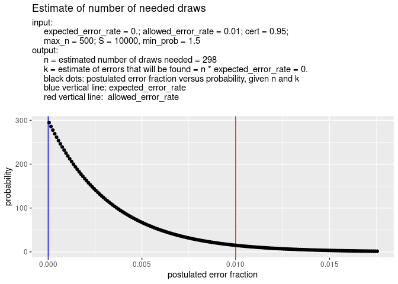

<!--README.md is generated from README.Rmd. Please edit that file -->

<!-- badges: start -->
[](https://github.com/cfjdoedens/drawsneeded/actions/workflows/R-CMD-check.yaml)
<!-- badges: end -->

# drawsneeded

The pacakage supports monetary unit sampling. In monetary unit sampling
we have a file of monetary statements. In general this concerns money
that has been spent. We want to estimate the percentage of money from
the file that was wrongfully spent, the error rate.

This very tiny package has the function, drawsneeded(). The function
gives an estimate of the number of monetary unit draws needed to
establish with some certainty that the error rate is below a certain
threshold.

This is only a good estimation. Due to randomness, the actual number of
monetary unit draws needed might be either to low or to high.

The package also has the function drawsneeded_plot() which calls
drawsneeded() and shows the result in a plot.

## Installation

You can install the development version of drawsneeded from
[GitHub](https://github.com/) with:

``` r
if (file.exists("/home/crist-jan/R/x86_64-pc-linux-gnu-library/4.5/drawsneeded")) {
  # We are executing on the author machine, use the development version available there.
  loadNamespace("drawsneeded")
} else {
  # Use the github version.
  if (!requireNamespace("pak", quietly = TRUE)) {
    install.packages("pak")
  }
  pak::pak("cfjdoedens/drawsneeded")
}
#> <environment: namespace:drawsneeded>
```

## Example: 0.1 percent error expected

Suppose you know from previous experience that a small error rate might
exist in the mass of monetary statements. You estimate the error rate to
be no more than 0.1 percent of the total mass in money. So you set
expected_error_rate to 0.001. You need a result with 95% certainty. So
you set certainty to 0.95, You decide that the maximum number of samples
you are willing to draw and check is 500. So you set max_n to 500.

``` r
library(drawsneeded)
drawsneeded(expected_error_rate = 0.001, cert = 0.95, allowed_error_rate = 0.01, max_n = 500)
#> [1] 365
```

The conclusion is that you will need at least 365 samples.

In a picture this looks like:

``` r
library(drawsneeded)
drawsneeded_plot(expected_error_rate = 0.001, cert = 0.95, allowed_error_rate = 0.01, max_n = 500)
```


## Example: no error expected

However, you might expect to see no error at all. Then you could
calculate as follows:

``` r
library(drawsneeded)
drawsneeded(expected_error_rate = 0.0, cert = 0.95, allowed_error_rate = 0.01, max_n = 500)
#> [1] 298
```

So probably 298 samples is sufficient.

In a picture this looks like:

``` r
library(drawsneeded)
drawsneeded_plot(expected_error_rate = 0.0, cert = 0.95, allowed_error_rate = 0.01, max_n = 500)
```



## Still TODO

- Handle case where only integer values of k are possible. For example
  when k \> 1 - cert, then round k up. Otherwise round k down.
- Possibly, add extra margin, so extra draws, by taking into account the
  standard deviation.
- There is something strange: you pretend to know something about the
  file to be audited, i.e. expected_error_rate \> 0, but you do not want
  to use that info in the estimation, or is that correct as this only
  concerns the planning phase? I get a bit confused.
- drawsneeded_plot(): work nicely with parameters of drawsneeded() that
  have length \> 1.
- drawsneeded_plot(): if possible, depict situation when too many draws
  are needed.
- drawsneeded_plot(): depict as multiple chance graphs different
  postulated values for k, in one picture.
