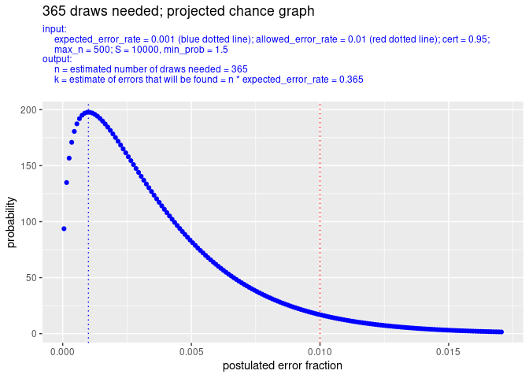

<!--README.md is generated from README.Rmd. Please edit that file -->

<!-- badges: start -->
[](https://github.com/cfjdoedens/drawsneeded/actions/workflows/R-CMD-check.yaml)

[](https://app.codecov.io/gh/cfjdoedens/drawsneeded)

<!-- badges: end -->

# drawsneeded

Supports monetary unit sampling. In monetary unit sampling we have a
file of monetary statements. In general this concerns money that has
been spent. We want to estimate the percentage of money from the file
that was wrongfully spent, the error rate.

This very tiny package has the function drawsneeded(). The function
gives an estimate of the number of monetary unit draws needed to
establish with some certainty that the error rate is below a certain
threshold.

This is only a good estimation. Due to randomness, the actual number of
monetary unit draws needed might be either to low or to high.

The package also has the function drawsneeded_plot() which calls
drawsneeded() and shows the result in a plot.

## Installation

You can install the development version of drawsneeded from
[GitHub](https://github.com/) with:

``` r
if (file.exists("/home/crist-jan/R/x86_64-pc-linux-gnu-library/4.5/drawsneeded")) {
  # We are executing on the author machine, use the development version available there.
  library("drawsneeded")
  print("using files directly from author of package; not from github")
} else {
  # Use the github version.
  if (!requireNamespace("pak", quietly = TRUE)) {
    install.packages("pak")
  }
  pak::pak("cfjdoedens/drawsneeded")
  print("using files from github")
}
#> [1] "using files directly from author of package; not from github"
```

## Example: 0.1 percent error expected

Suppose you know from previous experience that a small error rate might
exist in the mass of monetary statements. You estimate the error rate to
be no more than 0.1 percent of the total mass in money. So you set
expected_error_rate to 0.001. You need a result with 95% certainty. So
you set certainty to 0.95, You decide that the maximum number of samples
you are willing to draw and check is 500. So you set max_n to 500.

``` r
drawsneeded(expected_error_rate = 0.001, allowed_error_rate = 0.01, cert = 0.95, max_n = 500)
#> [1] 365
```

The conclusion is that you will need at least 365 samples.

In a picture this looks like:

``` r
drawsneeded_plot(expected_error_rate = 0.001,  allowed_error_rate = 0.01, cert = 0.95, max_n = 500)
```



## Example: no error expected

However, you might expect to see no error at all. Then you could
calculate as follows:

``` r
drawsneeded(expected_error_rate = 0.0, allowed_error_rate = 0.01, cert = 0.95, max_n = 500)
#> [1] 298
```

So probably 298 samples is sufficient.

In a picture this looks like:

``` r
drawsneeded_plot(expected_error_rate = 0.0, allowed_error_rate = 0.01, cert = 0.95, max_n = 500)
```


## Example: multiple expected_error_rate values

Suppose we want to try several different expected error rates in one go:

``` r
drawsneeded(expected_error_rate = seq(from = 0.0, by = 0.001, to = 0.009), allowed_error_rate = 0.01, cert = 0.95, max_n = 10000)
#>     0 0.001 0.002 0.003 0.004 0.005 0.006 0.007 0.008 0.009 
#>   298   365   458   594   801  1143  1767  3104  6894    -1
```

We see that as expected_error_rate goes near to allowed_error_rate, the
number of draws needed rises more strongly.

For the moment drawsneeded_plot() can not picture this in one plot.

## Example: multiple allowed_error_rate values

Suppose we want to try several different allowed error rates in one go:

``` r
drawsneeded(expected_error_rate = 0.001, allowed_error_rate = seq(from = 0.009, by = -0.001, to = 0.002), cert = 0.95, max_n = 10000)
#> 0.009 0.008 0.007 0.006 0.005 0.004 0.003 0.002 
#>   415   482   574   708   920  1305  2190  5757
```

We see, in analogy with the previous example, that as the
allowed_error_rate comes near to the expected_error_rate, the number of
draws needed rises.

## Example: multiple cert values

Suppose we want to try several different cert values in one go:

``` r
drawsneeded(expected_error_rate = 0.001, allowed_error_rate = 0.002, cert = seq(from = 0.60, by = 0.05, to = 0.95), max_n = 10000)
#>  0.6 0.65  0.7 0.75  0.8 0.85  0.9 0.95 
#> 1022 1251 1535 1895 2366 3012 3983 5757
```

We see, that as the cert value increases we need more and more draws.

## Still TODO

- Handle case where only integer values of k are possible. For example
  when k \> 1 - cert, then round k up. Otherwise round k down.
- Possibly, add extra margin, so extra draws, by taking into account the
  standard deviation.
- There is something strange: you pretend to know something about the
  file to be audited, i.e. expected_error_rate \> 0, but you do not want
  to use that info in the estimation, or is that correct as this only
  concerns the planning phase? I get a bit confused.
