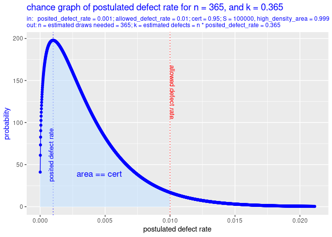
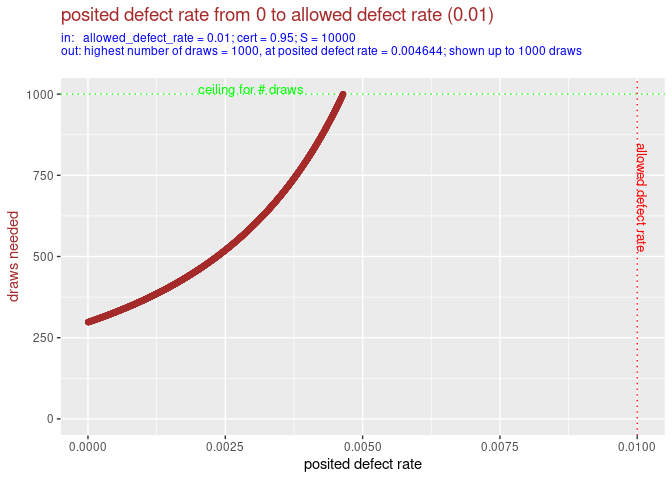
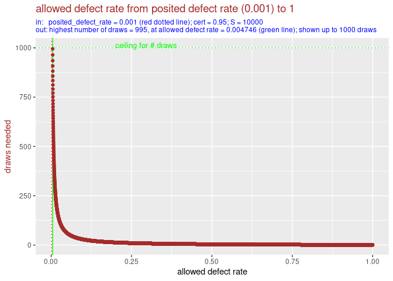
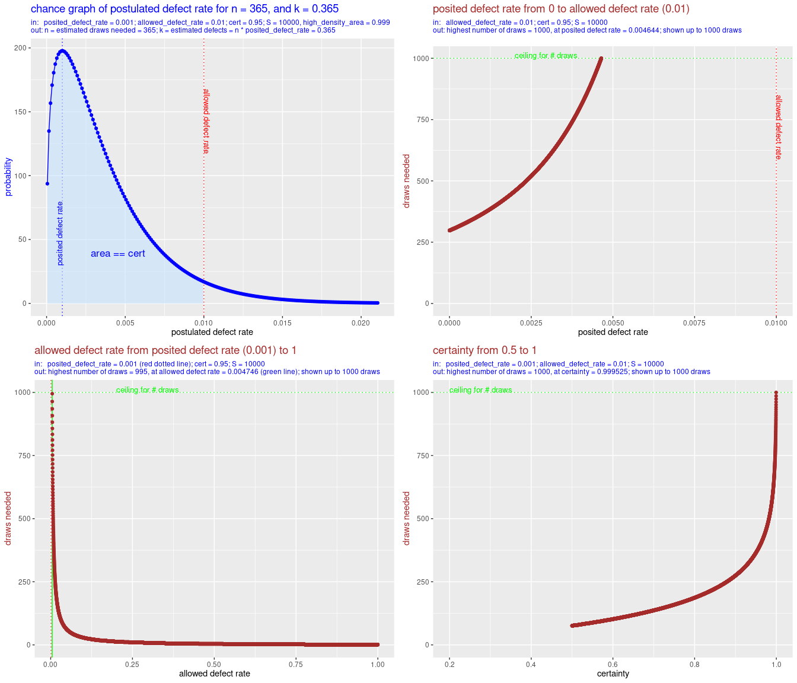
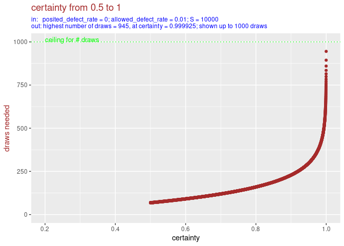
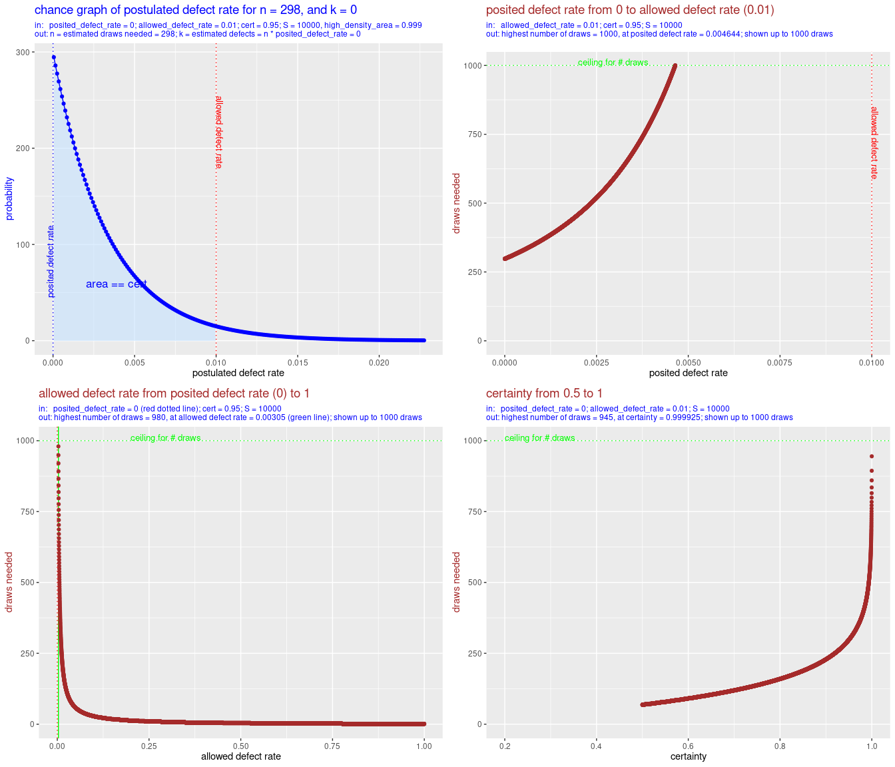

<!--README.md is generated from README.Rmd. Please edit that file -->

<!-- badges: start -->

[](https://github.com/cfjdoedens/drawsneeded/actions/workflows/R-CMD-check.yaml)

<!-- [](https://app.codecov.io/gh/cfjdoedens/drawsneeded) -->

<!-- badges: end -->

# drawsneeded

## Introduction

drawsneeded is an R package for use in auditing based on statistical
sampling. It helps choose the sample size. This is based on the required
level of certainty and the maximum allowed defect rate.

To make this more explicit, drawsneeded is useful when:

1.  you want to audit the defect rate of a set of like items, and
2.  you consider doing this audit by means of statistical sampling on
    the set of items, and
3.  you want to establish whether or not the defect rate is below a
    certain threshold, and
4.  you want to estimate how many items (draws) you need to sample, i.e.
    you want to estimate the needed sample size.

## Installation

You can install the development version of drawsneeded from
[GitHub](https://github.com/) with:

``` r
  if (!requireNamespace("devtools", quietly = TRUE)) {
    install.packages("devtools")
  }
  devtools::install_github("cfjdoedens/drawsneeded")
```

## Overview of functions

- drawsneeded() – Estimate number of samples required.
- drawsneeded_plot() – Visualize relationship between assumptions and
  sample size.
- plot_varying\_\*() – Examine sensitivity of required samples to
  different parameters.
- combined_plots() - Combine output of all plot functions in one
  picture.

## Main function: drawsneeded()

The function drawsneeded(posited_defect_rate, allowed_defect_rate, cert)
gives an estimate of the number of drawn items needed to establish with
some certainty level, *cert*, that the defect rate is below a certain
threshold, *allowed_defect_rate*. The assumption of drawsneeded() is
that each drawn item exactly has *posited_defect_rate*. It might be that
in practice the items have a defect of either 0 or 1, or, when they have
a defect on a scale from 0 to 1, most items have 0 defect and most items
will contain no defects at all, and some items will have a large defect,
or are even totally defective. So, in practice the defect rate may have
greater variance, but this assumption preserves its expected value.

Due to randomness, the actual number of needed drawn items might be
smaller or bigger. Also, it might turn out, that the set has a higher
defect rate than allowed_defect_rate. In that case no amount of draws
will suffice to prove that the defect rate is below allowed_defect_rate.

## Statistical model

drawsneeded can be used in audits of financial records or administrative
decisions, where the defect rate might be binary (0 or 1) or continuous
(ranging from 0 to 1).

For example:

- In a financial audit, the overall defect rate might be the proportion
  of funds spent improperly.
- In an administrative audit, the overall defect rate might be the
  proportion of decisions that violate policy.

The function drawsneeded(posited_defect_rate, allowed_defect_rate, cert)
gives an estimate of the minimum number of drawn items needed to
establish with some certainty, cert, e.g. 0.95, that the defect rate is
below allowed_defect_rate. For this estimation it assumes that the
actual defect rate in the file of items equals the posited_defect_rate.
It is up to the user of drawsneeded() to choose a posited_defect_rate().
When the posited_defect_rate is chosen conservative, i.e. on the high
side, it can be used with some confidence to produce a not too low
number. And vice versa we can set the posited_defect_rate on the low
side to get a bottom estimate of the number of items that need to be
drawn and checked.

drawsneeded() assumes that each item that will be drawn has a defect of
posited_defect_rate. And it computes the minimum number of drawn items
necessary to establish with cert certainty that posited_defect_rate \<
allowed_defect_rate. Note that it might actually not be possible for any
of the items in the file to have exactly that defect size.

The computation of this minimum is based on the binomial distribution.
This is extended with the beta distribution to allow for non integer
values of defects. (The binomial distribution assumes that there are
very many items to draw from, which all have equal chance of being
drawn, and there are so many items that when we have drawn some this
does not change in a substantial way the rate of erroneous items.)

Note that in this scheme the statistical procedure that is used to
estimate the defect rate in the file of items does *not* use the
posited_defect_rate! The posited_defect_rate is only used as means to
estimate the minimal number of items that need to be drawn to estimate
the defect rate with sufficient certainty. The posited_defect_rate is
used only for planning.

Note that the prior used by drawsneeded() is flat: each possible defect
rate is beforehand given an equal probability.

## Advanced use

### Planning versus execution

The number that is produced by drawsneeded() gives an estimate of how
many drawn items are needed to establish the defect rate in a set of
like items. In order to have a statistical sound estimate of the defect
rate, it is not necessary to stick to that planned number for actual
drawing and evaluation! The number is just an indication of the effort
needed.

For example, when drawsneeded() estimates that there are 365 draws
needed (see the first example below), it might turn out that after 298
draws checked, not one defect was found. If the 298 items were chosen
randomly, over the total set of items, it can be safely concluded that
the defect rate is not more than 1 %. And there is no need to check the
other 67 items.

On the other hand, when it turns out that the defect rate of the drawn
and evaluated so far items is above the posited_defect_rate, one can do
a new call on drawsneeded() to establish a new, and forcibly higher,
number of draws that are needed. Care should be taken then that all
items in the file had, and have, an equal chance of being selected.

### Combination with incremental drawing

In order to minimize the number of to be drawn and to be checked items
one can explicitly proceed by making an optimistic, i.e. low, guess of
the posited_defect_rate, and once this indeed turns out to be too
optimistic, plan anew as described above with the actual defect rate
found in the already checked items.

## Examples

### 0.1 percent defect expected

#### posited_defect_rate = *0.001*, allowed_defect_rate = 0.01, cert = 0.95

Suppose you know from previous experience that a small defect rate might
exist in the set of items. You guess the defect rate to be no more than
0.1 percent for the total set. So you set posited_defect_rate to 0.001.
You need a result with 95% certainty. So you set certainty to 0.95.

``` r
drawsneeded(posited_defect_rate = 0.001, allowed_defect_rate = 0.01,
            cert = 0.95)
#> [1] 365
```

The conclusion is that you will need at least 365 samples.

In a picture this looks like:

``` r
drawsneeded_plot(posited_defect_rate = 0.001,  allowed_defect_rate = 0.01,                                      cert = 0.95)
```



drawsneeded_plot() has called drawsneeded() to compute the number of
items that should be in the sample. This number is 365. The plot then
shows the chance graph, i.e. probability density function, of the
postulated defect rate given there were n = 365 items drawn, and the sum
of defects of these drawn items, k = n \* posited_defect_rate = n \*
0.01 = 365 \* 0.01 = 3.65.

We can further analyse the situation by varying over
posited_defect_rate, or over allowed_defect_rate or over cert. See the
following three plots.

#### Varying over the posited defect rate

First we vary over the posited defect rate:

``` r
plot_varying_posited_defect_rate(allowed_defect_rate = 0.01,
                                        cert = 0.95, max_n = 1000)
```



We see that as posited_defect_rate goes near to allowed_defect_rate, the
number of draws needed rises. In this graph only the results up to 1000
draws are shown. This limit can be made higher, thereby we zoom out to
100 times larger scale for the y-axis (the number of draws needed).

``` r
plot_varying_posited_defect_rate(allowed_defect_rate = 0.01,
                                        cert = 0.95, max_n = 100000)
```


As we can see, when the posited_defect_rate comes more close to the
allowed_defect_rate, the number of draws needed rises more sharply.
Compare this graph with the previous graph: we see that, due to a 100
times bigger scale on the y-axis, the curve looks much flatter, for the
part of the posited_defect_rate from 0 to 0.0050.

We can also study the variation of posited_defect_rate in a non
graphical way:

``` r
drawsneeded(posited_defect_rate = seq(from = 0.0, by = 0.001, to = 0.009),
            allowed_defect_rate = 0.01, cert = 0.95)
#>     0 0.001 0.002 0.003 0.004 0.005 0.006 0.007 0.008 0.009 
#>   298   365   458   594   801  1143  1767  3104  6894 27195
```

Again we see that for a posited defect rate of 0.001, we need 365 draws.
The advantage of the non graphical presentation is that we can more
easily compare the different numerical values.

#### Varying over the allowed defect rate

``` r
plot_varying_allowed_defect_rate(posited_defect_rate = 0.001,
                                        cert = 0.95)
```



We see that as the allowed_defect_rate moves away from the
posited_defect_rate, the number of draws falls sharply.

Non graphically this looks like (note the 365 computed draws needed for
allowed defect rate 0.01):

``` r
drawsneeded(posited_defect_rate = 0.001,
            allowed_defect_rate = seq(from = 0.002, by = 0.001, to = 0.01),
            cert = 0.95)
#> 0.002 0.003 0.004 0.005 0.006 0.007 0.008 0.009  0.01 
#>  5757  2190  1305   920   708   574   482   415   365
```

and,

``` r
drawsneeded(posited_defect_rate = 0.001,
            allowed_defect_rate = seq(from = 0.02, by = 0.01, to = 0.1),
            cert = 0.95)
#> 0.02 0.03 0.04 0.05 0.06 0.07 0.08 0.09  0.1 
#>  163  104   76   60   49   42   36   32   28
```

and,

``` r
drawsneeded(posited_defect_rate = 0.001,
            allowed_defect_rate = seq(from = 0.2, by = 0.1, to = 0.9),
            cert = 0.95)
#> 0.2 0.3 0.4 0.5 0.6 0.7 0.8 0.9 
#>  13   8   5   4   3   2   1   1
```

The non graphical presentation allows us to explore the variation of
values more precisely, than just looking at the graph.

#### Varying over the certainty

Finally we can also vary over the certainty we apply.

``` r
plot_varying_cert(posited_defect_rate = 0.001,
                         allowed_defect_rate = 0.01)
```


As might be expected: if we can do with less certainty, then we need
fewer draws.

In raw numbers this looks like:

``` r
drawsneeded(posited_defect_rate = 0.001, allowed_defect_rate = 0.01,
            cert = seq(from = 0.50, by = 0.05, to = 0.95))
#>  0.5 0.55  0.6 0.65  0.7 0.75  0.8 0.85  0.9 0.95 
#>   76   88  102  118  137  159  187  223  275  365
```

Note that for cert 0.95, we get again 365 draws needed.

#### All plots bundled in one picture

We can call combined_plots() to get all four plots in one picture.

``` r
combined_plots(posited_defect_rate = 0.001, allowed_defect_rate = 0.01,
               cert = 0.95)
```



The blue graph, i.e. the upper left, shows the chance density for values
from 0 to 1 of the defect rate for the minimum combination of n and k
given a *posited* defect rate of 0.001, allowed defect rate of 0.01, and
certainty of 0.95. The brown graphs, i.e. the other, show what happens
with the number of draws needed when we vary posited defect rate,
allowed defect rate and certainty.

### No defect expected

#### posited_defect_rate = *0*, allowed_defect_rate = 0.01, cert = 0.95

You might expect to see no defect at all in the to be audited set of
items. Then you could calculate as follows:

``` r
drawsneeded(posited_defect_rate = 0, allowed_defect_rate = 0.01,
            cert = 0.95)
#> [1] 298
```

So then 298 samples is sufficient.

In a picture this looks like:

``` r
drawsneeded_plot(posited_defect_rate = 0, allowed_defect_rate = 0.01,
                 cert = 0.95)
```


Again, we can further analyse the situation by varying over
posited_defect_rate, or over allowed_defect_rate or over cert. As we
have above already studied varying the posited_defect_rate, we will not
repeat that here.

#### Varying over the allowed defect rate

``` r
plot_varying_allowed_defect_rate(posited_defect_rate = 0, cert = 0.95)
```


We see that as the allowed_defect_rate moves away from the
posited_defect_rate, the number of draws falls sharply.

Non graphically this looks like:

``` r
drawsneeded(posited_defect_rate = 0,
            allowed_defect_rate = seq(from = 0.001, by = 0.001, to = 0.01),
            cert = 0.95)
#> 0.001 0.002 0.003 0.004 0.005 0.006 0.007 0.008 0.009  0.01 
#>  2994  1496   997   747   597   497   426   372   331   298
```

and,

``` r
drawsneeded(posited_defect_rate = 0,
            allowed_defect_rate = seq(from = 0.02, by = 0.01, to = 0.1),
            cert = 0.95)
#> 0.02 0.03 0.04 0.05 0.06 0.07 0.08 0.09  0.1 
#>  148   98   73   58   48   41   35   31   28
```

and,

``` r
drawsneeded(posited_defect_rate = 0,
            allowed_defect_rate = seq(from = 0.2, by = 0.1, to = 0.9),
            cert = 0.95)
#> 0.2 0.3 0.4 0.5 0.6 0.7 0.8 0.9 
#>  13   8   5   4   3   2   1   1
```

#### Varying over the certainty

Finally we can also vary over the certainty we apply.

``` r
plot_varying_cert(posited_defect_rate = 0, allowed_defect_rate = 0.01)
```



As might be expected: more certainty needs more draws.

In raw numbers this looks like:

``` r
drawsneeded(posited_defect_rate = 0, allowed_defect_rate = 0.01,
            cert = seq(from = 0.50, by = 0.05, to = 0.95))
#>  0.5 0.55  0.6 0.65  0.7 0.75  0.8 0.85  0.9 0.95 
#>   68   79   91  104  119  137  160  188  229  298
```

We recognize the number 298 as the number of draws needed for cert 0.95.

#### All plots bundled in one picture

We call combined_plots() to get all four plots in one picture.

``` r
combined_plots(posited_defect_rate = 0, allowed_defect_rate = 0.01,
               cert = 0.95)
```



The blue graph, i.e. the upper left one, shows the chance density for
values from 0 to 1 of the defect rate for the minimum combination of n
and k given a *posited* defect rate of 0.0, allowed defect rate of 0.01,
and certainty of 0.95. The brown graphs, i.e. the other, show what
happens with the number of draws needed when we vary posited defect
rate, allowed defect rate and certainty.

## Suggested extensions

- Add a prior to drawsneeded().
- Add a cost function that makes additional draws more expensive. The
  function can help with planning of incremental drawing.
- Add to this README an example table of draws needed based on
  variations of posited defect rate, allowed defect rate and certainty.
- Add a table function, that produces a table of draws needed based on
  variations of posited defect rate, allowed defect rate and certainty.
- Make the functionality of this package into a live shiny app.
